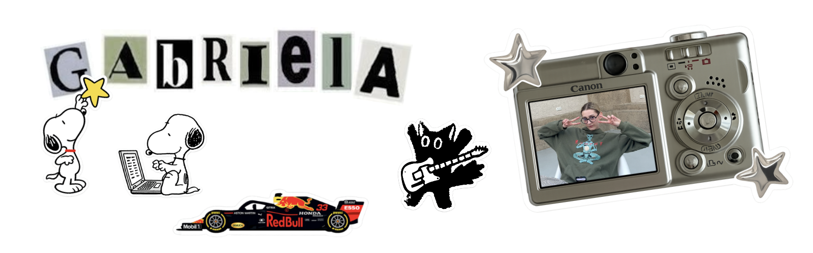

<table>
<tr>
<td width="45%" valign="top">

##  about me

 student blending fashion, IT, business and a thousand other hobbies

 love all things that spark curiosity

 I build projects that might look unrelated, but i call it creative output

</td>

<td width="55%" valign="top">

##  what you'll find here

a collection of projects, experiments and ideas
from a student who loves to explore.

 <b>data analysis</b>

 

- [Data Analysis Practice](https://github.com/imgabrielas/DataAnalysisPractice)
- [Formula 1 Data Analysis](https://github.com/imgabrielas/Formula1-Data-Analysis)

 

 <b>machine learning</b>

 

- [How 2 Make ML](https://github.com/imgabrielas/How-To-Make-ML)
- [Sephora](https://github.com/imgabrielas/Sephora)
- [Alzheimer Detection](https://github.com/imgabrielas/Alzheimer-Detection)
- [F1 Belgian Grand Prix 2026 Winner Prediction](https://github.com/imgabrielas/F1-Belgian-GP-2026)
 

 <b>Computer Vision</b>

 

- [PyPhotobooth](https://github.com/imgabrielas/PyPhotobooth)

 <b>web development</b>

 

- await in patience ;))

 <b>creative projects</b>

 

- [PyPlayground](https://github.com/imgabrielas/py-playground)
- [Legally Blonde ESP32](https://github.com/imgabrielas/Legally-Blonde-ESP32)

</td>
</tr>
</table>

