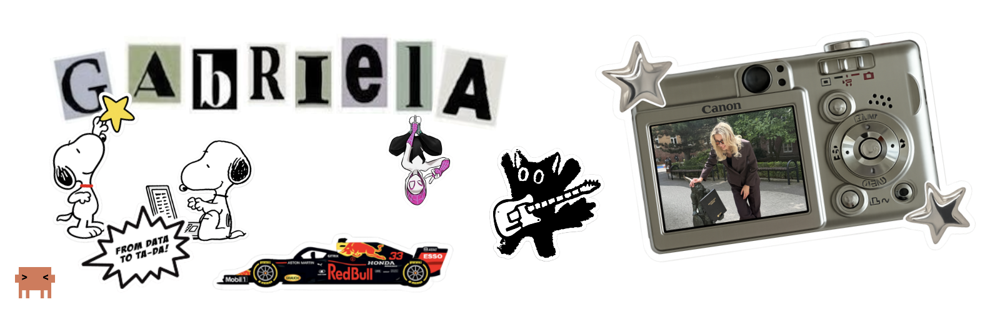
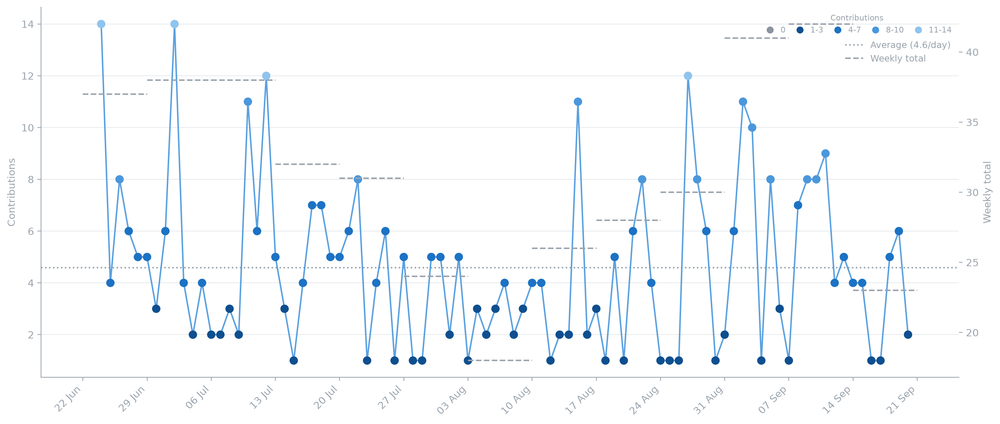

<table>
<tr>
<td width="45%" valign="top">

##  about me

 student blending fashion, IT, business and a thousand other hobbies 

 love all things that spark curiosity 

 I build projects that might look unrelated, but i call it creative output 

</td>

<td width="55%" valign="top">

##  what you'll find here

a collection of projects, experiments & ideas
from a student who loves to explore.

 <b>Data Analysis</b>

 

- [Data Analysis Practice](https://github.com/imgabrielas/DataAnalysisPractice)
- [Sephora Analysis](https://github.com/imgabrielas/Sephora) 
  End-to-end data analysis project on Sephora product & review data. Python descriptive and predictive analysis, Power BI report.

 

 <b>Machine Learning</b>

  

- [How 2 Make ML](https://github.com/imgabrielas/How-To-Make-ML) 
  Might just be my most used repo ;)) Used for practice, feel free to check it out!

- [Not so Small ML](https://github.com/imgabrielas/Not-So-Small-ML) 
  Small end-to-end data science projects. 
  - [Alzheimer Detection](https://github.com/imgabrielas/Not-So-Small-ML/tree/main/alzheimer) |  [Gold Price Prediction](https://github.com/imgabrielas/Not-So-Small-ML/tree/main/Gold%20Price%20Prediction) | [Phishing Websites](https://github.com/imgabrielas/Not-So-Small-ML/tree/main/Phishing%20Websites)

- [Kaggle Competitions](https://www.kaggle.com/work/competitions) 
  - [Kaggle Competition Smartphone Addiction](https://github.com/imgabrielas/Not-So-Small-ML/tree/main/smartphone-addiction) | [Kaggle Competition Electric Vehicle Purchases](https://github.com/imgabrielas/Not-So-Small-ML/tree/main/Electric-Vehicle-Purchases) 

- [Sephora Analysis](https://github.com/imgabrielas/Sephora) 
  End-to-end data analysis project on Sephora product & review data. Python descriptive and predictive analysis, Power BI report.

- [F1](https://github.com/imgabrielas/F1-Enthusiast.git) 
  As a Formula 1 fan, this is my hobby project. Ongoing - needs more work, as F1 is fairly complex and quite unpredictable. Standings analysis & winner prediction.

- [Amazon Sales](https://github.com/imgabrielas/Amazon-sales) 

- [Biometry](https://github.com/imgabrielas/Biometry)

 <b>Deep Learning</b>

 

- [Grey Matter Multiplication](https://github.com/imgabrielas/Grey_Matter_Multiplication) 
Small end-to-end DL projects.

- [Italian GP Winner Prediction](https://github.com/imgabrielas/F1-Enthusiast/tree/main/Italian%20GP%20Winner%20Prediction)

 <b>GenAI</b>

 

- [GenAI LAB](https://github.com/imgabrielas/GenAI-Lab)

 <b>Computer Vision</b>

 

- [PyPhotobooth](https://github.com/imgabrielas/PyPhotobooth)
- [Hand Tracker](https://github.com/imgabrielas/cv-hand-tracking)
- [Biometry](https://github.com/imgabrielas/Biometry)

 <b>Web Development</b>

 

- [Personal website](https://imgabrielas.com/)

 <b>Creative Projects</b>

 

- [PyPlayground](https://github.com/imgabrielas/py-playground)
- [Legally Blonde ESP32](https://github.com/imgabrielas/Legally-Blonde-ESP32)

</td>
</tr>
</table>

 

